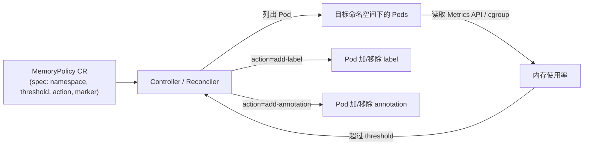

# CLAUDE.md

This file provides guidance to Claude Code (claude.ai/code) when working with code in this repository.

## 项目概述

本仓库是一个作业项目，目标是开发 Kubernetes Operator **MemoryGuard Operator**。
该 Operator 自动监控 Pod 的内存使用情况，当内存超过指定阈值时自动添加标签或注解，便于 HPA、监控告警等系统识别和处理。

完整的需求清单、评分标准、进阶挑战见 `issue.md`（作业题目原文）。

## 项目状态

**脚手架已完成**（kubebuilder 4.1.1 / go/v4 插件 / Go 1.26.2）。已生成项目骨架、CRD 类型、validating webhook 骨架，`make build` 通过。
- module `github.com/balcony314/operator-demo`，domain `example.com`，API group `memory.example.com/v1`，kind `MemoryPolicy`
- 构建工具使用 **Make**（`Makefile`）；任务列表 `make help`
- **已完成**：Reconciliation 逻辑、部署到集群、stress 集成测试（见 `docs/integration-test.md`）。
- `issue.md` 为作业题目原文；kubebuilder 另生成大写 `README.md`，内容不同，两者需保留区分。

## 构建与测试命令

```bash
make manifests      # 生成 CRD/RBAC/webhook yaml（config/crd/bases、config/rbac、config/webhook）
make generate       # 生成 deepcopy（api/v1/zz_generated.deepcopy.go）
make build          # 编译 bin/manager（依赖 manifests/generate/fmt/vet 串并行编排）
make install        # kubectl apply CRD 到当前集群
make run            # 本地运行 controller（需 ~/.kube/config）
make test           # envtest 单元测试
make docker-build   # 构建 manager 镜像
make deploy         # 部署到集群
make uninstall      # 卸载 CRD（先清 CR 防 finalizer 卡死，IGNORE_NOT_FOUND=true 忽略 not-found）
make uninstall-all  # 一键彻底卸载：undeploy + uninstall + 删 namespace
make help           # 列出全部任务
```

依赖工具（controller-gen、kustomize、envtest）由 Makefile 自动 `go install` 到 `bin/`，无需手动补装。CI（`.github/workflows/`）已改为 `make`（make 为 runner 预装，无需额外安装）。

## 代码结构

- `api/v1/memorypolicy_types.go` — CRD 类型（Spec：Namespace/Threshold/Action/Marker + validation markers；Status：Conditions）
- `internal/controller/memorypolicy_controller.go` — Controller / Reconciler（Reconcile 已实现：finalizer/标记加移/RequeueAfter）
- `internal/controller/metrics.go` - Prometheus 自定义指标（`memoryguard_marked_pods` Gauge）
- `internal/webhook/v1/memorypolicy_webhook.go` — validating webhook（threshold 0-100、action 枚举、marker.key 非空）
- `cmd/main.go` — manager 入口，注册 controller 与 webhook
- `config/` — Kustomize 部署清单（crd、rbac、manager、webhook、certmanager、prometheus 等）
- `PROJECT`、`Makefile`、`go.mod`、`Dockerfile` — 项目元数据与构建

## 目标架构

核心由三部分组成（标准 Operator 模式）：



- **CRD**：`MemoryPolicy`（`apiVersion: memory.example.com/v1`）
  - `spec.namespace`：目标命名空间，不填则监控所有
  - `spec.threshold`：内存阈值百分比（0-100）
  - `spec.action`：`add-label` 或 `add-annotation`
  - `spec.marker`：键值对 `{key, value}`
- **Controller / Reconciler 闭环**：
  1. Watch `MemoryPolicy` 变化
  2. 列出目标命名空间下所有 Pod，获取内存使用（Metrics API 或 cgroup）
  3. 超阈值且未标记 → 按 `action` 添加 label/annotation
  4. 内存恢复且已标记 → 移除标记
  5. `MemoryPolicy` 被删除 → 清理该 Policy 添加的所有标记
- **错误处理**：获取不到内存指标时记录 Event 并重试。

## 进阶挑战（加分项）

- ✓ 多命名空间监控（`spec.namespace` 空=全集群）
- ✓ Admission Webhook：校验 `threshold` 0-100、action 枚举、marker.key 非空
- ✓ Prometheus 自定义指标：`memoryguard_marked_pods{policy,namespace}` Gauge（`internal/controller/metrics.go`）
- ✓ 优雅降级：Metrics API 不可用时改用 `request/limit` 估算使用率，status 标 MetricsDegraded

集成测试见 `docs/integration-test.md`，脚本在 `test/integration/`（`make integration-test` 一键运行 6 场景）。
