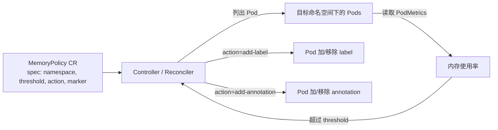

# MemoryGuard Operator

Kubernetes Operator，自动监控 Pod 内存使用情况。当内存超过指定阈值时按配置添加 label 或 annotation，便于 HPA、监控告警等系统识别和处理；内存恢复后自动移除标记。

> 作业项目：基于 CRD + Controller + Reconciliation 模式，用 Kubebuilder 搭建的内存守护 Operator。学习目标覆盖 Operator 核心工作原理、Reconciliation 逻辑实现、CR 编写与测试。

## 目标架构



核心闭环（Reconcile，每 30s 轮询）：

1. Watch `MemoryPolicy` 与 `Pod` 变化
2. 列出目标命名空间下所有 Pod，拉取 PodMetrics 计算内存使用率（`usage / memory.limit × 100`）
3. 超阈值且未标记 → 按 `action` 添加 label/annotation + 归属 annotation `memory.example.com/managed-by-policy`
4. 内存恢复且已标记 → 移除标记 + 归属 annotation
5. `MemoryPolicy` 被删除 → finalizer 清理该 Policy 添加的所有标记

## 项目结构

```
.
├── api/v1/memorypolicy_types.go        # CRD 类型（Spec/Status + validation markers）
├── internal/controller/
│   ├── memorypolicy_controller.go       # Reconciler（闭环 / finalizer / 降级）
│   └── metrics.go                       # Prometheus 自定义指标
├── internal/webhook/v1/memorypolicy_webhook.go  # validating webhook
├── cmd/main.go                          # manager 入口
├── config/                              # Kustomize 部署清单（crd/rbac/manager/webhook/certmanager/prometheus）
├── test/integration/                    # 集成测试脚本（6 场景）
├── test/e2e/                            # e2e 测试
├── docs/integration-test.md             # 集成测试文档
├── Makefile / Dockerfile / PROJECT      # 构建与元数据
└── issue.md                             # 作业题目原文
```

## CRD 定义

```yaml
apiVersion: memory.example.com/v1
kind: MemoryPolicy
metadata:
  name: example-policy
spec:
  namespace: "default"      # 目标命名空间，不填则监控所有
  threshold: 80             # 内存阈值百分比（0-100）
  action: "add-label"       # add-label 或 add-annotation
  marker:                   # 要添加的键值对
    key: "memory-overload"
    value: "true"
```

各字段均带 OpenAPI schema 校验：`namespace` 可选（空=全集群）、`threshold` 0-100、`action` 枚举（add-label/add-annotation）、`marker.key` 必填。

### CRD 注册验证

```sh
make install    # 生成并 apply CRD 到集群

# 验证 CRD 已注册
kubectl get crd memorypolicies.memory.example.com
# 期望输出：NAME                                  CREATED AT
#          memorypolicies.memory.example.com   ...

# 验证 schema 生效（threshold=150 应被拒）
echo 'apiVersion: memory.example.com/v1
kind: MemoryPolicy
metadata: {name: t}
spec:
  threshold: 150
  action: add-label
  marker: {key: k, value: v}' | kubectl apply -f -
# 期望：被 CRD schema 拒绝（Maximum=100）
```

## 快速开始

### 前置条件

- Go 1.26+
- Docker 17.03+
- kubectl，可访问的 Kubernetes 集群（1.30+）
- minikube（本地测试）
- make

### 集成测试（minikube）

```sh
# 1. 环境准备（自动处理国内镜像源、部署 cert-manager/metrics-server/operator）
bash test/integration/00-setup.sh

# 2. 一键运行 6 场景测试
bash test/integration/run-all.sh

# 3. 单独运行某场景
bash test/integration/10-webhook-validation.sh

# 4. 清理（保留 operator）
bash test/integration/99-cleanup.sh
# 4. 彻底卸载（含 operator）
bash test/integration/99-cleanup.sh --all
```

测试覆盖：

| 场景 | 验证内容 |
|---|---|
| 1 webhook 校验 | threshold 0-100、action 枚举、marker.key 非空 |
| 2 核心闭环 | 超阈值加标记 + 恢复移除 |
| 3 finalizer 清理 | 删 Policy 后标记全清，非卡 Terminating |
| 4 add-annotation | 标记以 annotation 形式加 |
| 5 Prometheus 指标 | `memoryguard_marked_pods{policy,namespace}` |
| 6 优雅降级 | Metrics API 不可用时 request/limit 估算 + status Degraded |

### 部署

```sh
# 构建并推送镜像（IMG 自行替换为你的 registry）
make docker-build docker-push IMG=<some-registry>/operator-demo:tag

# 安装 CRD
make install

# 部署 operator（webhook 需 cert-manager 签发证书）
make deploy IMG=<some-registry>/operator-demo:tag

# 创建示例 MemoryPolicy
kubectl apply -k config/samples/
```

> **注意**：validating webhook 依赖 cert-manager 签发 serving 证书。若集群未安装 cert-manager，CR 创建会因 caBundle 为空而被拒。安装方式见 [cert-manager 文档](https://cert-manager.io/docs/installation/)。

### 手动 stress 验证（阶段三）

`run-all.sh` 已自动化以下三步，亦可手动验证。前提：已 `bash 00-setup.sh` 完成 operator 部署。

```sh
# 1. 创建 stress Pod（256Mi limit，占 220Mi = 86% > 80% 阈值）
kubectl apply -f - <<'EOF'
apiVersion: v1
kind: Pod
metadata:
  name: stress-pod
  namespace: default
spec:
  restartPolicy: Never
  volumes:
  - name: m
    emptyDir: {medium: Memory, sizeLimit: 240Mi}
  containers:
  - name: s
    image: busybox
    imagePullPolicy: IfNotPresent
    volumeMounts: [{name: m, mountPath: /mem}]
    command: ["/bin/sh", "-c"]
    args: ["dd if=/dev/zero of=/mem/blob bs=1M count=220 2>/dev/null; sleep 3600"]
    resources:
      limits: {memory: 256Mi}
      requests: {memory: 32Mi}
EOF

# 2. 创建 MemoryPolicy（threshold=80, add-label）
kubectl apply -f config/samples/memory_v1_memorypolicy.yaml

# —— 验证 1：~1-3 分钟后 Pod 被打上标记 ——
kubectl get pod stress-pod -o jsonpath='{.metadata.labels.memory-overload}'
# 期望：true

# —— 验证 2：释放内存后标记移除 ——
kubectl exec stress-pod -- rm /mem/blob
kubectl get pod stress-pod -o jsonpath='{.metadata.labels.memory-overload}'
# 期望：（空）

# —— 验证 3：删除 Policy 后标记被清理 ——
kubectl delete memorypolicy memorypolicy-sample
kubectl get pod stress-pod -o jsonpath='{.metadata.labels.memory-overload}'
# 期望：（空，finalizer 清理）
```

> metrics-server 采集周期约 60s，标记出现/移除需等待 1-3 分钟。

## 卸载

```sh
kubectl delete -k config/samples/   # 删除 CR
make uninstall                      # 删除 CRD
make undeploy                       # 卸载 controller
```

## 依赖

| 依赖 | 版本 | 说明 |
|---|---|---|
| controller-runtime | v0.24.1 | Operator 框架（kubebuilder 4.x 组合） |
| k8s.io/* | v0.36.0 | api/apimachinery/client-go/metrics |
| Go | 1.26 | |
| controller-gen | v0.21.0 | 生成 CRD/RBAC/webhook 清单（Makefile 自动安装到 `bin/`） |
| kustomize | v5.8.1 | 渲染部署清单 |
| cert-manager | v1.16.0 | 集群运行时依赖，签发 webhook 证书 |
| metrics-server | v0.7.1 | 可选，PodMetrics 数据源；不可用时触发降级 |

## 进阶挑战

- ✅ **多命名空间监控**：`spec.namespace` 空 = 全集群
- ✅ **Webhook 验证**：threshold 0-100、action 枚举、marker.key 非空
- ✅ **Prometheus 指标**：`memoryguard_marked_pods{policy,namespace}` Gauge
- ✅ **优雅降级**：Metrics API 不可用时改用 request/limit 估算，status 标 `MetricsDegraded`

## 挑战与解决方案

- **国内镜像源不可达**：`00-setup.sh` 经 daocloud 镜像拉取 `golang:1.26` / `gcr.io/distroless/static:nonroot` 并 retag 为原名；manager 构建注入 `GOPROXY=https://goproxy.cn,direct`。metrics-server 镜像 patch 为阿里云无 sha 版本。
- **stress Pod 内存占用**：minikube 容器 `/dev/shm` 默认 64MB 不足，改用 `emptyDir.medium: Memory` 的 tmpfs（独立配额）dd 写 220Mi，metrics-server 正确计入 workingset。
- **metrics 采集延迟**：metrics-server 采集周期约 60s，标记出现/移除需 1-3 分钟。脚本 `wait_until` 默认超时 180s。
- **多 Policy 共存**：标记时附加归属 annotation `memory.example.com/managed-by-policy=<policy名>`，finalizer 据此精确清理，不误删其他 Policy 的标记。

## 评分对照

| 评分项 | 分值 | 实现位置 | 状态 |
|---|---|---|---|
| CRD 设计 | 20 | `api/v1/memorypolicy_types.go`（字段+注释+校验 marker） | ✅ |
| Controller 逻辑 | 40 | `internal/controller/memorypolicy_controller.go`（闭环+finalizer+降级） | ✅ |
| 部署与测试 | 20 | `make deploy` + `test/integration/`（6 场景全过） | ✅ |
| 代码质量 | 15 | 中文注释、controller/webhook/metrics 分文件 | ✅ |
| 进阶挑战 | 15（上限） | 多命名空间/webhook/prometheus/降级 4 项 | ✅ |

## 参考资料

- [Kubebuilder 官方文档](https://book.kubebuilder.io/introduction.html)
- [Operator SDK 文档](https://sdk.operatorframework.io/)
- [Kubernetes API Conventions](https://github.com/kubernetes/community/blob/master/contributors/devel/sig-architecture/api-conventions.md)
- [Custom Resource Basics](https://kubernetes.io/docs/concepts/extend-kubernetes/api-extension/custom-resources/)

## License

详见 [LICENSE](LICENSE)
